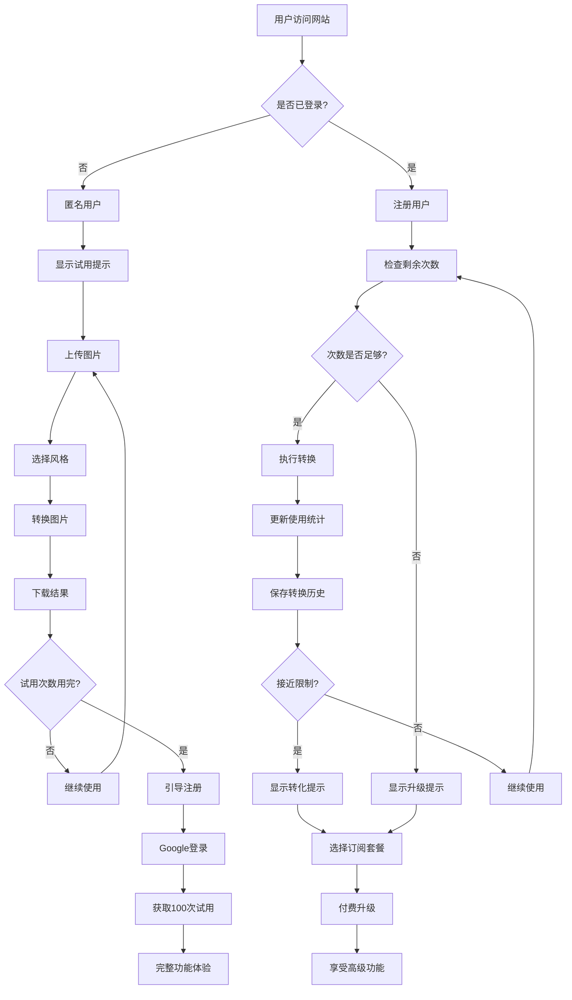
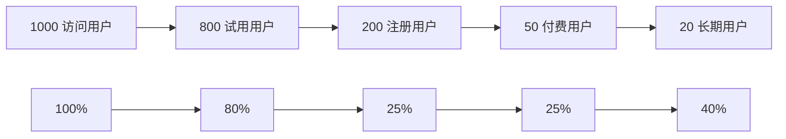
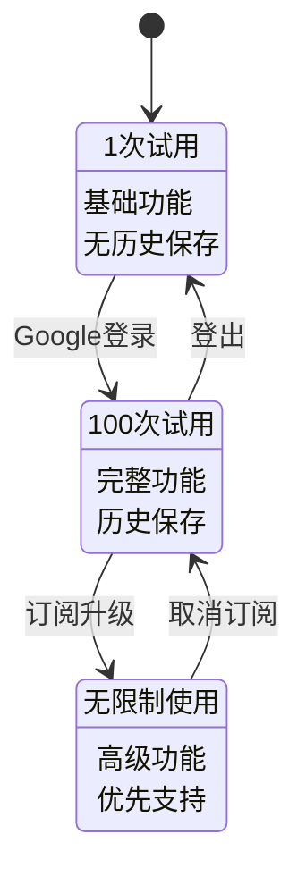
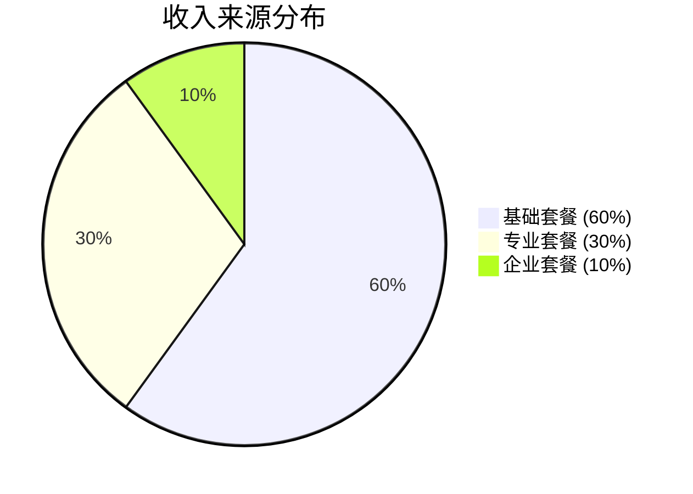
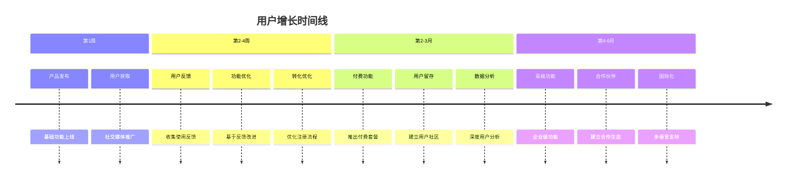
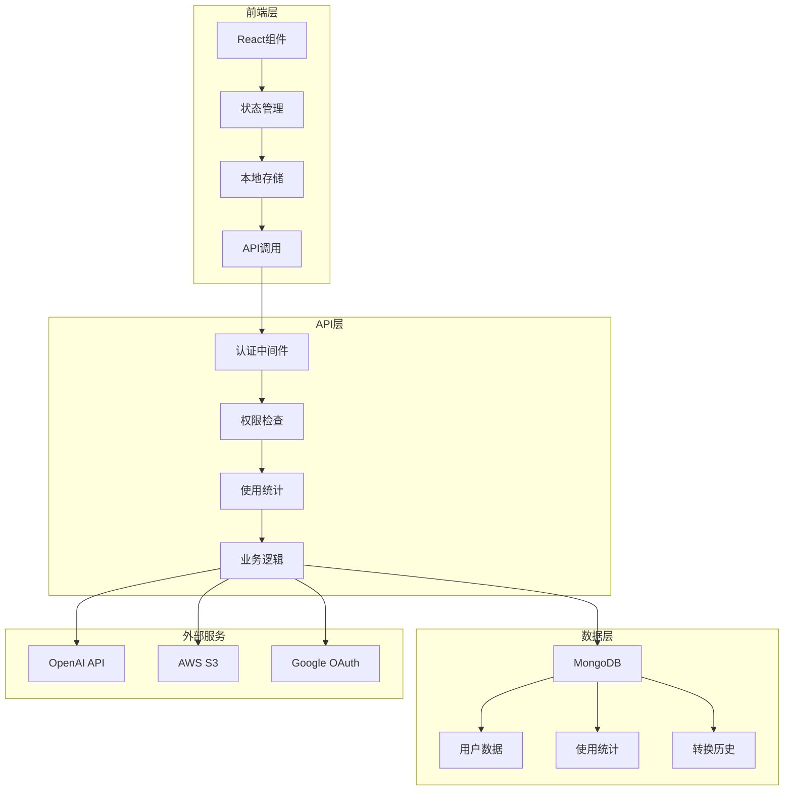
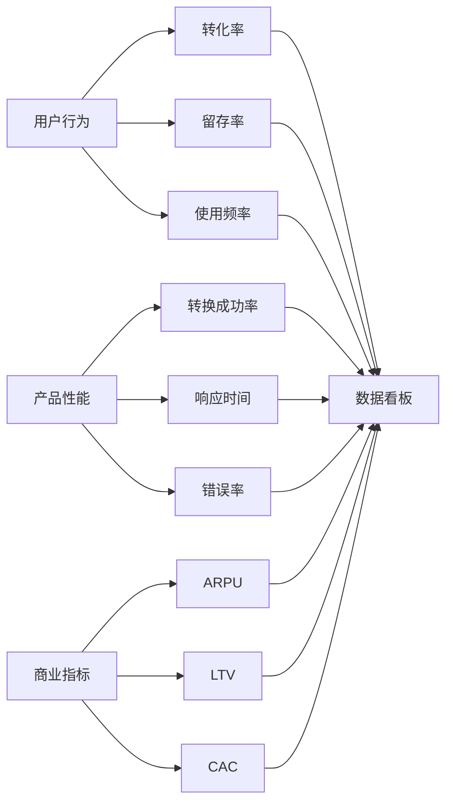

# 免费试用方案流程图

## 🎯 用户旅程流程图

## 📊 转化漏斗分析

## 🔄 用户状态转换图

## 💰 收入模型图

## 📈 用户增长策略

## 🎨 功能限制对比表

| 功能特性 | 匿名用户 | 注册用户 | 基础套餐 | 专业套餐 | 企业套餐 |
|---------|---------|---------|---------|---------|---------|
| 转换次数 | 1次 | 100次 | 500次/月 | 2000次/月 | 无限制 |
| 文件大小 | 2MB | 5MB | 10MB | 20MB | 50MB |
| 分辨率 | 512x512 | 1024x1024 | 1024x1024 | 2048x2048 | 4096x4096 |
| 风格选择 | 1种 | 4种 | 4种 | 8种+自定义 | 全部+定制 |
| 历史保存 | ❌ | 30天 | 90天 | 1年 | 永久 |
| 批量处理 | ❌ | ❌ | ❌ | ✅ | ✅ |
| API访问 | ❌ | ❌ | ❌ | ❌ | ✅ |
| 优先支持 | ❌ | ❌ | ❌ | ✅ | ✅ |

## 🔧 技术实现架构

## 📊 关键指标监控

## 🎯 转化优化策略

### 1. 注册转化优化
- **时机**: 在用户完成第一次转换后立即提示
- **激励**: 提供额外50次试用作为注册奖励
- **简化**: 一键Google登录，减少注册步骤

### 2. 付费转化优化
- **时机**: 当用户使用次数达到80次时开始提示
- **价值**: 展示付费用户的高级功能和优势
- **优惠**: 首次订阅享受8折优惠

### 3. 用户留存优化
- **内容**: 定期推送新的风格和功能
- **社区**: 建立用户分享和展示平台
- **反馈**: 收集用户反馈并快速响应

---

**设计时间**: 2025年9月6日  
**版本**: v1.0  
**状态**: 待实施

